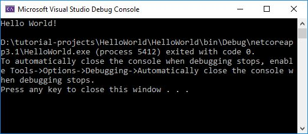

[](https://rclapp.com/bootcamp.html)

****

# Create a console application

- Open Visual Studio

- On the start window, choose **Create a new project**

- On the **Create a new project** window, enter **console** in the search box. 

- Next, choose **C#** from the Language list, and then choose **Windows** from the Platform list

- After you apply the language and platform filters, choose the **Console App (.NET Core)** template, and then choose **Next**


- In the **Configure your new project** window, type or enter **HelloWorld** in the **Project name** box. 

- Select a folder to store the project. Then, choose **Create**.


## The application code

In the code editor, you will see the following C# code:

```java
using System;

namespace HelloWorld
{
    class Program
    {
        static void Main(string[] args)
        {
            Console.WriteLine("Hello World!");
        }
    }
}

```

The code will write a line of text, 'Hello World', in the console window.

### Run the application

- In the top menu, look for the **HelloWorld** application with a green play button and click it to run the application.

- Ensure the application is set to run in 'Debug' mode.


- View the result of your application code in the console window.



- Close the console window when you are done.

****

# Bob Tabor Videos

[Courtesy Microsoft and Bob Tabor](https://channel9.msdn.com/Series/CSharp-Fundamentals-for-Absolute-Beginners)

****

> NOTE - These videos are a little dated, Visual Studio 2013/2015 is being used here. However, the principles are basically the same.

*****

## Creating Your First C# Programme

<div style="overflow:hidden; padding-bottom:56.25%; position:relative; height:0;">
<iframe style="left:0; top:0; height:100%; width:100%; position:absolute;" src="https://www.youtube.com/embed/b0Re3LKMYQU?autoplay=0&rel=0" frameborder="0" allow="accelerometer; autoplay; encrypted-media; gyroscope; picture-in-picture" allowfullscreen></iframe>
</div>

****

## Understanding Your First C# Programme

<div style="overflow:hidden; padding-bottom:56.25%; position:relative; height:0;">
<iframe style="left:0; top:0; height:100%; width:100%; position:absolute;" src="https://www.youtube.com/embed/a9CHPlx-a4M?autoplay=0&rel=0" frameborder="0" allow="accelerometer; autoplay; encrypted-media; gyroscope; picture-in-picture" allowfullscreen></iframe>
</div>

****

[](https://rclapp.com/mentors.html)

****

<div id="disqus_thread"></div>
<script>
var disqus_config = function () {
this.page.url = 'https://csharpfoundation.tutorial.rclapp.com/lessons/lesson1.html';
this.page.identifier = 'a03-01'; 
};
(function() { 
var d = document, s = d.createElement('script');
s.src = 'https://coding-skills-io.disqus.com/embed.js';
s.setAttribute('data-timestamp', +new Date());
(d.head || d.body).appendChild(s);
})();
</script>
<noscript>Please enable JavaScript to view the <a href="https://disqus.com/?ref_noscript">comments powered by Disqus.</a></noscript>
